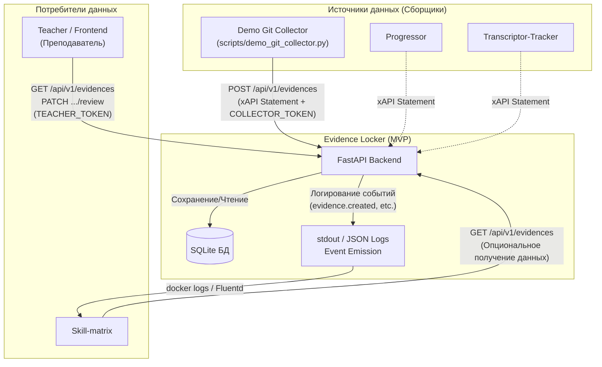
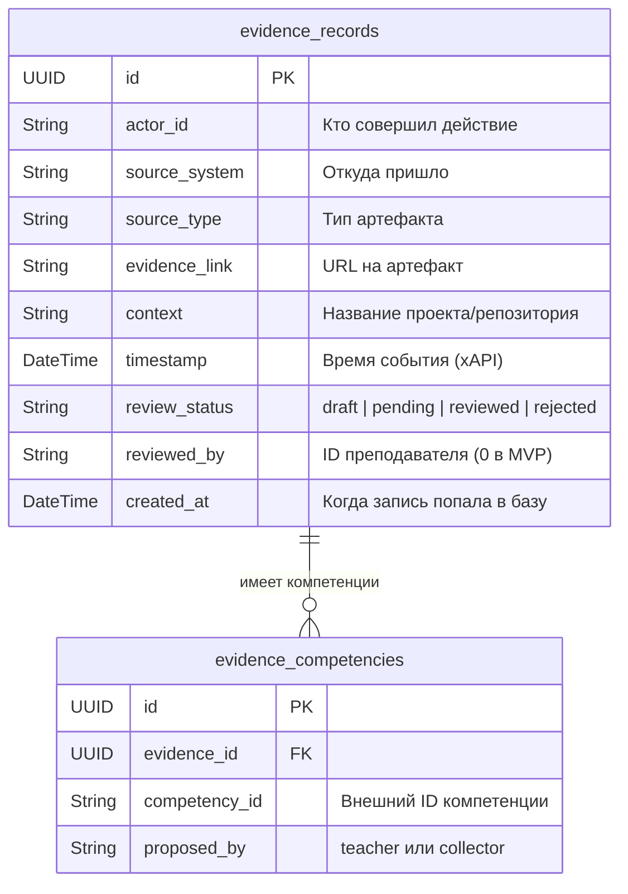
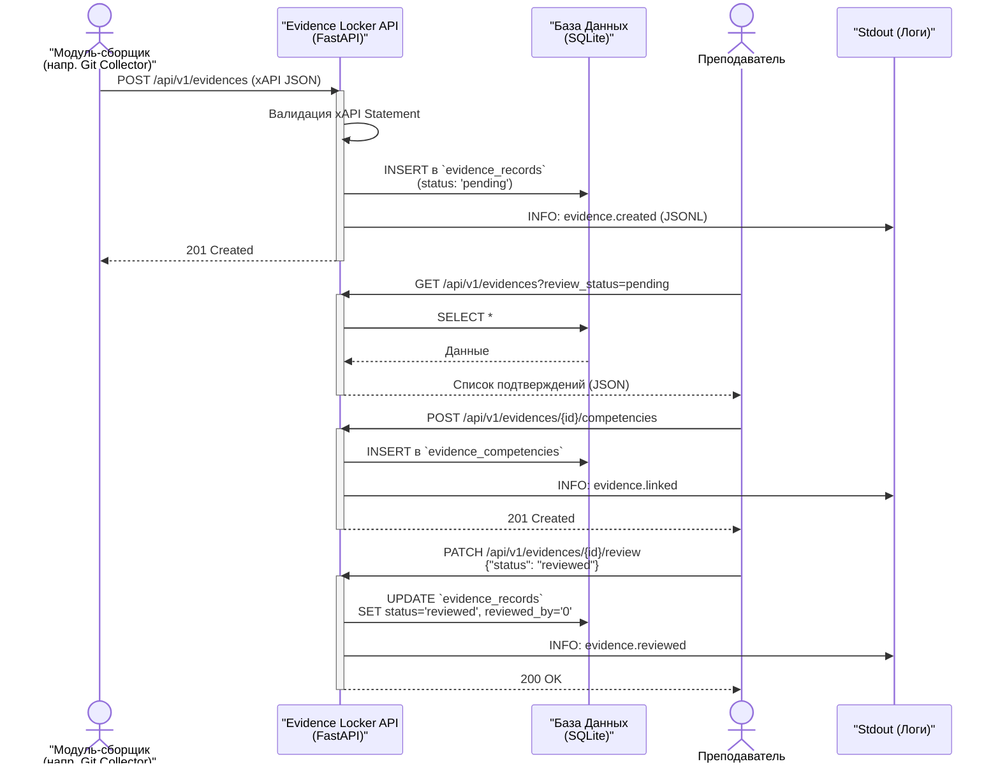

# Evidence-Locker

## Позиционирование модуля в системе

### 1. Название и роль модуля в системе
**Evidence Locker** — централизованное хранилище проверяемых следов работы (свидетельств). По типу это инфраструктурный модуль (бэкенд-сервис). Его главная роль — принимать стандартизированные события-свидетельства в формате xAPI от других модулей-сборщиков (например, Transcriptor-Tracker, Progressor, Git Collector) и предоставлять к ним доступ преподавателям для проверки и модулям-визуализаторам (например, Skill-matrix) для построения картины прогресса.

### 2. Решаемая задача
В учебной рабочей среде прогресс должен отслеживаться прозрачно, без необходимости ручного написания отчетов. Модули-помощники автоматизируют фиксацию результатов (анализируют код, встречи, задачи), но им нужно единое место для сохранения этих фактов. Без Evidence Locker данные от разных модулей были бы разрознены: логи трекера в одном месте, результаты расшифровки аудио — в другом, оценки коммитов — в третьем. Это не позволяет собрать общую картину навыков студента. Evidence Locker решает эту проблему, выступая "единым окном" (точкой сбора) для всех образовательных артефактов, приводя их к единому стандарту xAPI.

### 3. Главная гипотеза
Если предоставить всем независимым модулям простой и стандартизированный способ отправки свидетельств (через REST API и xAPI формат), то можно автоматически агрегировать данные о прогрессе студентов без дополнительных ручных отчетов, а преподавателям будет удобнее верифицировать эти достижения в одном месте.

### 4. Пользователи и рабочие сценарии
- **Модули-сборщики (Автоматизированные агенты):** Регулярно отправляют новые факты деятельности в систему (например, демо-сборщик из Git).
- **Преподаватели/Наставники:** Открывают список необработанных (pending) свидетельств, просматривают контекст, одобряют/отклоняют их, а также могут привязывать конкретные свидетельства к определенным компетенциям.
- **Учащиеся:** Просматривают свои одобренные подтверждения для оценки собственного прогресса (информация доступна по студенческому токену).
- **Модули-визуализаторы (например, Skill-matrix):** Получают поток подтвержденных событий для обновления матриц навыков.

**Рабочий сценарий (MVP):**
1. Скрипт-сборщик извлекает факт (например, написанный студентом коммит) и отправляет его в Evidence Locker в формате xAPI.
2. Преподаватель делает запрос для получения новых свидетельств (`status: pending`).
3. Убедившись в значимости коммита, преподаватель одобряет свидетельство (`status: reviewed`) и привязывает к нему компетенцию (например, "teamwork").
4. Evidence Locker логирует факты изменения статуса и привязки компетенции в стандартный вывод (stdout), откуда их забирают другие модули для аналитики.

## Продуктовые требования

### 5. Границы минимальной версии (MVP)

**Входит в минимальную версию:**
- REST API для приема валидных xAPI Statements (строгая валидация Pydantic).
- Хранение данных в легковесной локальной БД (SQLite).
- 2 основные таблицы: `evidence_records` (основное хранилище) и `evidence_competencies` (связи с компетенциями).
- Простая аутентификация через статичные токены в `.env` (TEACHER, COLLECTOR, STUDENT).
- Эндпоинты для просмотра, смены статуса (ревью) и привязки компетенций.
- Логирование машинно-читаемых событий (`evidence.created`, `evidence.reviewed`, `evidence.linked`) в `stdout` (JSON Lines).
- Вспомогательный скрипт `demo_git_collector.py` для тестирования полного флоу.

**Не входит в минимальную версию:**
- Брокеры сообщений (RabbitMQ/Kafka) — заменены на вывод в `stdout` для сохранения слабой связанности.
- Полноценная система аутентификации (OAuth, JWT для конкретных пользователей).
- Графический пользовательский интерфейс (Frontend).
- Сложная система прав (в `.env` будут прописаны 3 токена, у каждого из которых свои ограниченные права).

### 6. Входные данные
- **xAPI Statement:** JSON-объект строгой структуры: `Кто (Actor) -> Что сделал (Verb) -> С чем (Object) -> В каком контексте (Context)`.
- **Query-параметры поиска:** Фильтры по `actor_id`, `competency_id`, `context`, `review_status`.
- **Команды от преподавателя:** Смена статуса (approved/rejected), ID привязываемой компетенции.
- **Токены доступа:** Передаются в заголовках для авторизации операций.

### 7. Выходные данные и артефакты
- **JSON-ответы API:** Карточки подтверждений (списки свидетельств) с текущими статусами при запросах на чтение.
- **Логи в `stdout` (Event Emission):** Машинно-читаемые события в формате JSON Lines о добавлении, проверке или связи свидетельства. Они нужны не пользователю, а соседним модулям (например, Skill-matrix).
- **Данные в SQLite (`data/`):** Сохраненное состояние артефактов и привязок.

### 8. Интеграции и соседние модули
- **Входящие связи:** Модули-источники (Progressor, Transcriptor-Tracker) используют REST API `POST /api/v1/evidences`. Для тестирования используется локальный `demo_git_collector.py`.
- **Исходящие связи:** Модули-визуализаторы (например, Skill-matrix) могут получать данные через REST API (выполняя GET-запросы с соответствующими фильтрами). Уведомления об изменении статусов (события `evidence.reviewed` или `evidence.linked`) реализованы не через прямое API, а через JSON-логи в `stdout`. Другие системы могут читать эти логи через механизмы `docker logs` или сборщики логов (например, Fluentd).

### 9. Технологический стек
- Python 3.12
- FastAPI (для быстрой разработки REST API и валидации Pydantic).
- SQLAlchemy 2.0.
- SQLite (достаточно для MVP, не требует отдельного контейнера БД).
- Docker, docker-compose.
- `uv` (для сверхбыстрой сборки образа и установки пакетов).

### 10. Возможные аналоги
Существующие LRS (Learning Record Store) системы и инструменты вроде Watershed или Yet Analytics. Отличие Evidence Locker в том, что он максимально легковесен, не имеет GUI на этапе MVP и тесно интегрирован со спецификой локальной учебной рабочей среды (например, отсутствие тяжелого брокера очередей, интеграция через stdout/хуки).

## Ожидаемый результат и полевые испытания

### 11. Ожидаемый результат
Работающее API в Docker-контейнере, принимающее стандартизированные данные. Отсутствие ошибок валидации при корректном xAPI Statement. Успешный транзит свидетельства из статуса `pending` в `reviewed` с логированием процесса.

### 12. Полевые испытания
1. Разворачивается контейнер `docker-compose up`.
2. Запускается локальный сборщик `scripts/demo_git_collector.py` с токеном `COLLECTOR_TOKEN`.
3. Сборщик формирует валидный xAPI Statement и отправляет в API. API сохраняет его как `pending`.
4. Выполняется GET-запрос с токеном `TEACHER_TOKEN` для получения новых записей.
5. Выполняется PATCH-запрос для смены статуса на `reviewed` и POST-запрос для привязки компетенции `teamwork`.
6. Ожидается, что при каждом изменении в консоли Docker появятся соответствующие JSON-события.

### 13. Метрики успеха (MVP)
- Успешное выполнение сценария полевых испытаний от начала и до конца.
- 100% строгая валидация входящих xAPI данных (некорректный JSON должен отбрасываться).
- Скорость развертывания проекта (благодаря `uv` и SQLite).

## Структура проекта и запуск

### 14. Ожидаемая структура проекта

Evidence Locker представляет собой FastAPI-приложение, реализующее REST API для работы со свидетельствами.

Примерная структура проекта:

```text
evidence-locker/
├── app/                        # Основной код приложения (FastAPI)
│   ├── api/                    # Маршрутизаторы (endpoints)
│   │   ├── dependencies.py     # Инъекции зависимостей (проверка токенов)
│   │   └── v1/
│   │       ├── ingestion.py    # Эндпоинты для сбора (POST /evidences)
│   │       └── workflow.py     # Эндпоинты для ревью и поиска (GET, PATCH, POST competencies)
│   ├── core/                   # Ядро (настройки, логирование)
│   ├── db/                     # Работа с базой данных SQLite
│   │   ├── database.py         # Подключение к SQLite
│   │   └── models.py           # SQLAlchemy модели (evidence_records, evidence_competencies)
│   ├── schemas/                # Pydantic модели (xAPI Statement и др.)
│   └── main.py                 # Точка входа FastAPI приложения
├── scripts/                    # Вспомогательные скрипты
│   └── demo_git_collector.py   # Демо-сборщик из тех. задания
├── data/                       # Папка для локальной SQLite базы (mount в Docker)
├── .env.example                # Шаблон переменных окружения (TEACHER_TOKEN, etc.)
├── .gitignore                  # Исключения для Git (venv, .env, data/*.sqlite)
├── Dockerfile                  # Инструкции для сборки образа (с использованием uv)
├── docker-compose.yml          # Compose-файл для поднятия API и БД
├── pyproject.toml              # Управление зависимостями через uv
├── README.md                   # Главный документ репозитория
└── CONTRIBUTING.md             # Правила командной разработки
```

- `app/main.py` — точка входа FastAPI.
- `app/api/` — маршруты (endpoints) и инъекции зависимостей (dependencies).
- `app/db/` — модели SQLAlchemy и работа с SQLite базой данных.
- `app/schemas/` — Pydantic-модели для валидации формата xAPI Statement.
- `scripts/demo_git_collector.py` — пример сборщика для полевых испытаний.
- `data/` — папка для хранения SQLite БД (не коммитится).

### 15. Установка, запуск и автоматизация

Для единообразия с другими модулями закладываются стандартные команды в `Makefile`:

- `make install` — устанавливает зависимости (через `uv`).
- `make test` — запускает проверки и тесты.
- `make run` — локальный запуск Uvicorn (FastAPI).
- `make run-demo` — прогоняет пример из скрипта `demo_git_collector.py`.
- `make docker-build` — собирает Docker-контейнер.
- `make docker-up` — запускает модуль в контейнере через `docker-compose`.

В файле `.env.example` должны быть примеры токенов, необходимых для тестирования (`TEACHER_TOKEN`, `COLLECTOR_TOKEN`, `STUDENT_TOKEN`), и путь к SQLite базе данных. Настоящие рабочие токены не должны попадать в репозиторий.

## Безопасность, приватность и ограничения

### 16. Безопасность и приватность

Модуль работает с данными об учебном прогрессе. 
- Токены доступа (TEACHER_TOKEN, COLLECTOR_TOKEN, STUDENT_TOKEN) должны передаваться через защищенные переменные окружения, их нельзя сохранять в коде репозитория.
- Данные SQLite сохраняются локально в volume-папку. Файлы БД (`evidence.db`) не должны попадать в систему контроля версий (добавлены в `.gitignore`).

### 17. Риски и ограничения

- **Отсутствие сложной авторизации:** MVP использует статичные токены для трех ролей. Это означает, что все преподаватели используют один и тот же токен. Полноценный OAuth/JWT не реализуется на этом этапе.
- **Отсутствие GUI:** Преподавателям придется использовать REST-клиенты (Postman, Swagger) для утверждения свидетельств, что может быть неудобно без интеграции с модулями фронтенда.
- **Масштабируемость:** SQLite подходит для прототипирования, но может не справиться с конкурентной записью большого числа событий (xAPI) в высоконагруженной среде. В будущем потребуется переход на PostgreSQL.

## Разработка

### 18. Декомпозиция

Разработка MVP может быть разделена на следующие задачи:
1. **Инициализация проекта:** Настройка FastAPI, SQLAlchemy, SQLite, `pyproject.toml` и `Makefile`.
2. **Валидация xAPI:** Создание Pydantic-моделей для парсинга и валидации формата xAPI Statement.
3. **Хранение данных:** Создание SQLAlchemy моделей `evidence_records` и `evidence_competencies`.
4. **Прием данных:** Эндпоинт `POST /api/v1/evidences` (принимает xAPI, сохраняет в статусе `pending`, пишет в stdout `evidence.created`).
5. **Просмотр данных:** Эндпоинт `GET /api/v1/evidences` с фильтрацией по `review_status`.
6. **Верификация:** Эндпоинты `PATCH /api/v1/evidences/{id}/review` и `POST /api/v1/evidences/{id}/competencies` (с логированием `evidence.reviewed` и `evidence.linked` в stdout).
7. **Аутентификация:** Dependency в FastAPI для проверки токенов (Teacher/Collector/Student).
8. **Сборщик-пример:** Написание `scripts/demo_git_collector.py` для тестирования полного флоу.
9. **Контейнеризация:** Подготовка `Dockerfile` и `docker-compose.yml`.

---

## Архитектура и схемы

### 1. Архитектура и интеграция модулей
Система строится на принципе слабой связанности (Loose coupling). Данная диаграмма показывает место Evidence Locker среди других компонентов "Учебной рабочей среды".



### 2. Схема базы данных (ER-диаграмма)



### 3. Процесс верификации свидетельства (Verification Workflow)



---

## Паспорт модуля (module.yaml)

```yaml
name: evidence_locker
title: Evidence Locker
type: core_module
status: draft

problem: >
  Модули генерируют полезные сигналы (свидетельства) о работе и освоенных навыках
  учащихся, но без единого хранилища эти сигналы разрознены. Нужна система
  агрегации проверяемых следов в едином формате.

hypothesis: >
  Если собирать все активности из разных источников в стандарте xAPI в единую базу,
  то можно будет строить объективную и проверяемую картину навыков без ручного
  заполнения отчетов.

primary_user: >
  Модули-сборщики (интеграция данных), Преподаватель/Наставник (верификация).

inputs:
  - xAPI Statement (строго валидированный JSON)
  - запросы на ревью (одобрить/отклонить)
  - запросы на привязку компетенций

outputs:
  - JSON со списками свидетельств
  - машинно-читаемые события (logs) в stdout (evidence.created, evidence.reviewed)

primary_interface: REST API

optional_interfaces:
  - CLI (для тестового сборщика demo_git_collector)

integrations:
  - Transcriptor-Tracker (источник)
  - Progressor (источник)
  - Skill-matrix (потребитель событий)
  - Fluentd/Vector (сборщик логов из stdout)

mvp_scope: >
  Реализация FastAPI эндпоинтов для приема xAPI, хранения в SQLite. Эндпоинты
  для смены статуса и связи компетенций. Статичные токены доступа. Эмиссия
  событий в консоль.

field_trial: >
  Запуск demo_git_collector.py, передача валидного события, проверка его
  сохранения, смена статуса преподавателем и проверка появления события в stdout.

success_metrics:
  - полное прохождение сценария верификации без ошибок
  - строгая блокировка невалидного xAPI формата

risks:
  - формат xAPI может оказаться слишком строгим для некоторых источников
  - отсутствие брокера сообщений усложнит интеграцию потребителей логов на поздних этапах
```
