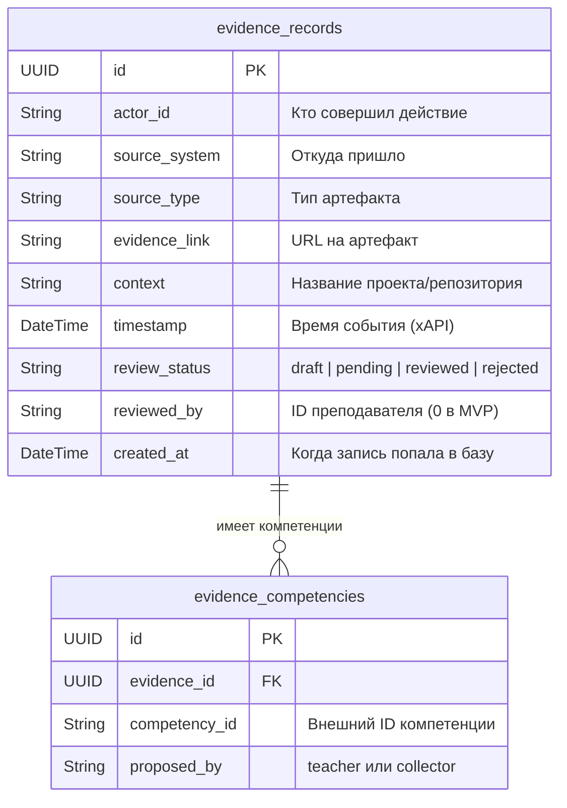
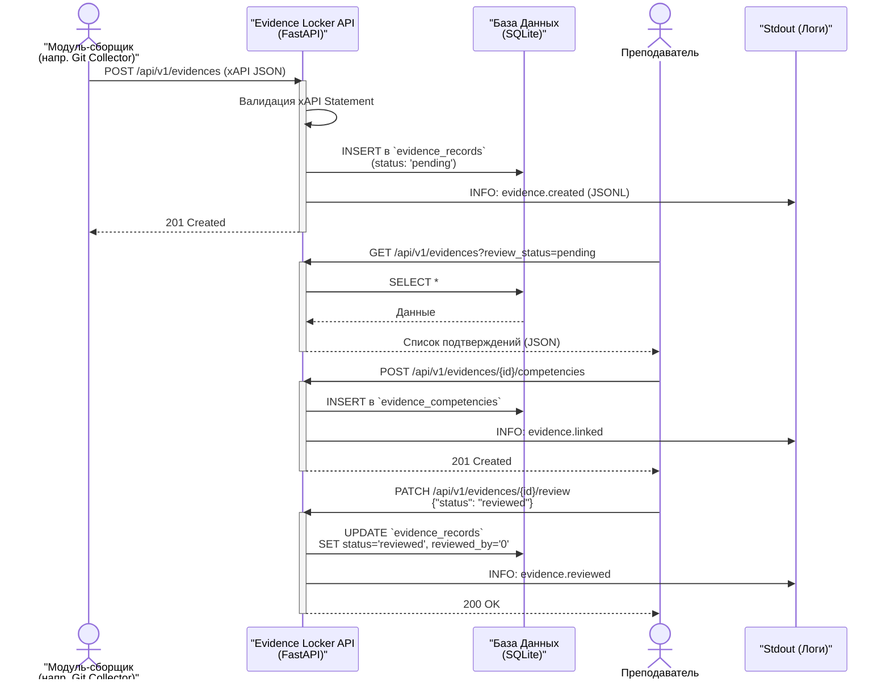

# Визуализация работы Evidence-Locker

Ниже представлены Mermaid-диаграммы, которые помогут визуально понять архитектуру, структуру базы данных и процессы (workflow) модуля **Evidence Locker**, основываясь на техническом задании и контексте практики.

## 1. Архитектура и интеграция модулей (Context & Architecture)

Система строится на принципе слабой связанности (Loose coupling). Данная диаграмма показывает место Evidence Locker среди других компонентов "Учебной рабочей среды".

```mermaid
graph TD
    subgraph "Источники данных (Сборщики)"
        GC["Demo Git Collector<br/>(scripts/demo_git_collector.py)"]
        P[Progressor]
        T[Transcriptor-Tracker]
    end

    subgraph "Evidence Locker (MVP)"
        API[FastAPI Backend]
        DB[(SQLite БД)]
        STDOUT["stdout / JSON Logs<br/>Event Emission"]
    end

    subgraph "Потребители данных"
        SM[Skill-matrix]
        TEA["Teacher / Frontend<br/>(Преподаватель)"]
    end

    %% Data Flow
    GC -- "POST /api/v1/evidences\n(xAPI Statement + COLLECTOR_TOKEN)" --> API
    P -. "xAPI Statement" .-> API
    T -. "xAPI Statement" .-> API

    API -- "Сохранение/Чтение" --> DB
    API -- "Логирование событий\n(evidence.created, etc.)" --> STDOUT

    STDOUT -- "docker logs / Fluentd" --> SM
    SM -- "GET /api/v1/evidences\n(Опциональное получение данных)" --> API
    
    TEA -- "GET /api/v1/evidences\nPATCH .../review\n(TEACHER_TOKEN)" --> API
```

> [!NOTE]
> В MVP версии брокер сообщений не используется. События (`evidence.created`, `evidence.reviewed`) пишутся в **stdout**, откуда их могут забирать другие модули (например, Skill-matrix).

---

## 2. Схема базы данных (ER-диаграмма)

Диаграмма "Entity-Relationship" для основных таблиц, спроектированных Тимлидом.

---

## 3. Процесс верификации свидетельства (Verification Workflow)

Sequence-диаграмма (Диаграмма последовательности), описывающая путь свидетельства от момента генерации до проверки преподавателем.

> [!TIP]
> Токены аутентификации (`COLLECTOR_TOKEN` и `TEACHER_TOKEN`) передаются в заголовках или параметрах запросов (через Dependency Injection) для ограничения прав доступа на каждом этапе (Developer 1).
